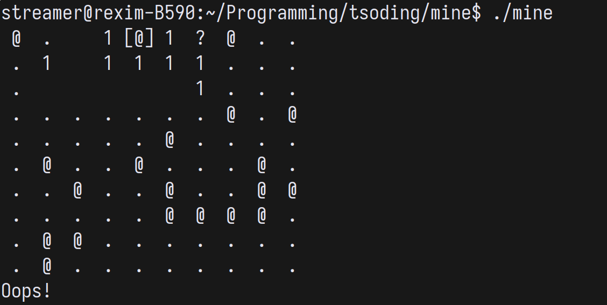

# Terminal Minesweeper



## Quick Start

It's written in [Free Pascal](https://www.freepascal.org/download.html) (sorry about that).

```console
$ fpc ./mine.pas
$ ./mine
```

## Controls

| key                                                 | description        |
|-----------------------------------------------------|--------------------|
| <kbd>w</kbd>,<kbd>a</kbd>,<kbd>s</kbd>,<kbd>d</kbd> | Move cursor around |
| <kbd>SPACE</kbd>                                    | Open cell          |
| <kbd>f</kbd>                                        | Flag/unflag cell   |
| <kbd>r</kbd>                                        | Restart            |
| <kbd>q</kbd>                                        | Quit               |

## Debug Mode

Build with debug mode:

```console
$ fpc -dDEBUG mine.pas
$ ./mine
```

### Debug Controls

| key | description |
|---|---|
| <kbd>p</kbd> | Peek behind closed cells |
